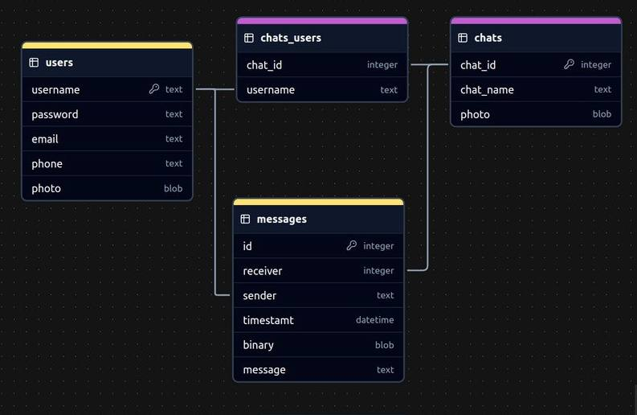
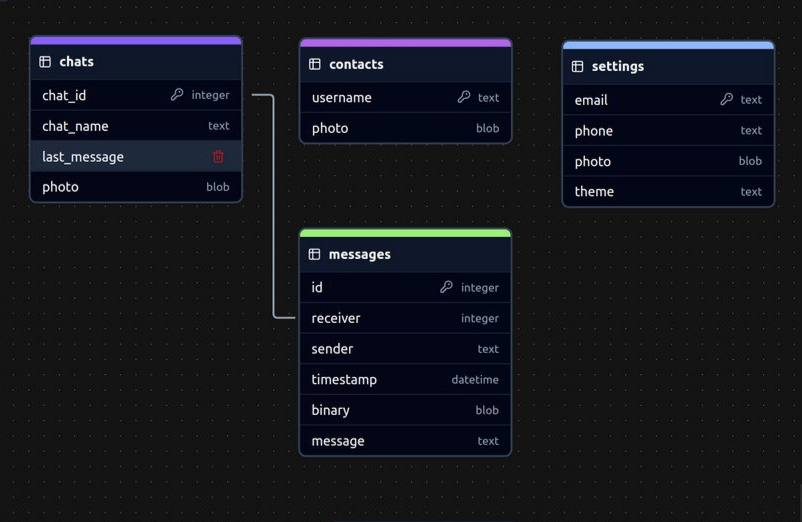

# Application Architecture

### Overview

This document outlines the modular architecture of the server and client
components of the messaging application. The design focuses on maintaining
a clear separation of concerns, facilitating easier development, testing,
and maintenance.

---

---

## Server Modules

### 1. Initialization

*    Launching the server as a daemon (detachment from terminal, running in background mode).
*    Configuring sockets and starting to listen on the designated port.
*    Initializing logs and the database.

### 2. Connection Handling

*    Accepting new client connections.
*    Managing the connection queue, handling multithreading.
*    Allocating resources based on the server's capabilities.

### 3. Request Processing

* Parsing incoming JSON-formatted requests.
* Identifying the request type and routing it to the appropriate submodule.
* Generating responses and formatting them in JSON.

### 4. Authentication

*    Performing client authentication through login or token.
*    Checking the availability of session tokens.
*    Creating new sessions or restoring previous ones, storing session data.

### 5. Database Management

*    Validating data integrity.
*    Executing queries to the database.
*    Responding to requests with the necessary data.

### 6. Security

*    Encrypting/decrypting transmitted data.

### 7. Monitoring

*    Logging events and connections.
*    Creating performance and load reports.
*    Alerting on errors or suspicious actions.

--- 

## Client Modules

### 1. Initialization

*    Configuring connection parameters (loading configurations).
*    Initializing the graphical interface and data cache.
*    Loading previous sessions and authorization tokens.

### 2. Connection

*    Establishing a TCP connection with the server.
*    Automatic reconnection in case of disconnection.

### 3. Data Caching

*    Storing essential data (chats, contacts) locally for offline mode.
*    Updating the cache upon successful retrieval of new data from the server.
*    Managing older data (cache rotation, clearing outdated chats).
*    Loading cached data for offline mode access.

### 4. Graphical Interface

*    Displaying chats, contacts, and statuses.
*    Responding to user actions (sending messages, creating new chats).
*    Updating the interface upon changes in connection status or new data arrival.

### 5. Security

*    Encrypting messages before sending them to the server.
*    Decrypting incoming data.
*    Securely storing local data (tokens, configurations).

### 5. Data Exchange
*   Formatting structured JSON requests for server interactions.
*   Parsing JSON responses from the server into usable data objects.
*   Validating JSON data for integrity and correctness before and after transmission.
*   Managing JSON format adjustments to adapt to evolving data requirements.

---

This modular architecture is designed to support the efficient development of
a messaging application by providing clear responsibilities for each component.
This organization will enhance the team's ability to work concurrently
on different parts of the application while maintaining high quality
and security standards.

# Server Data Base Architecture

* [server db json file](Assets/server.json)

# Client Data Base Architecture

* [client db json file](Assets/client.json)

