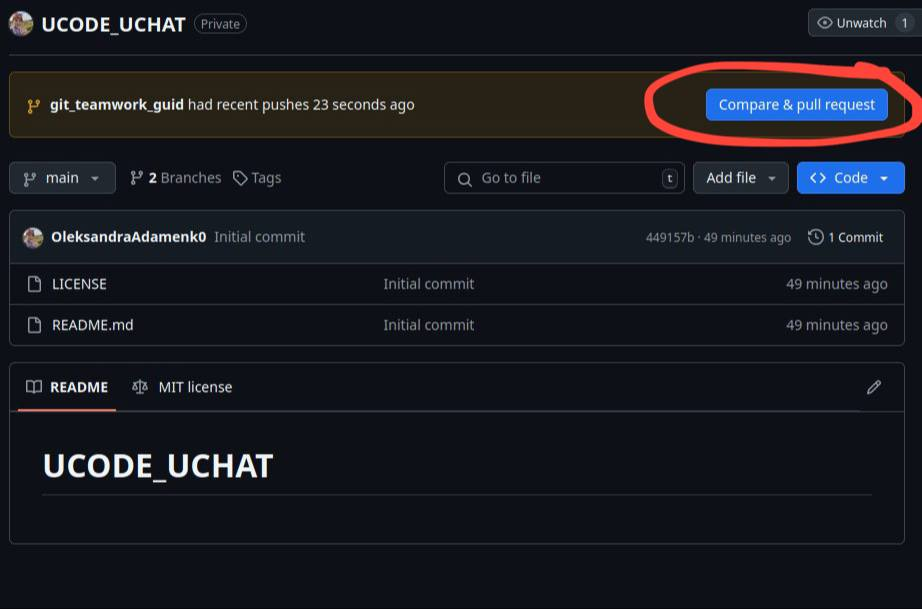
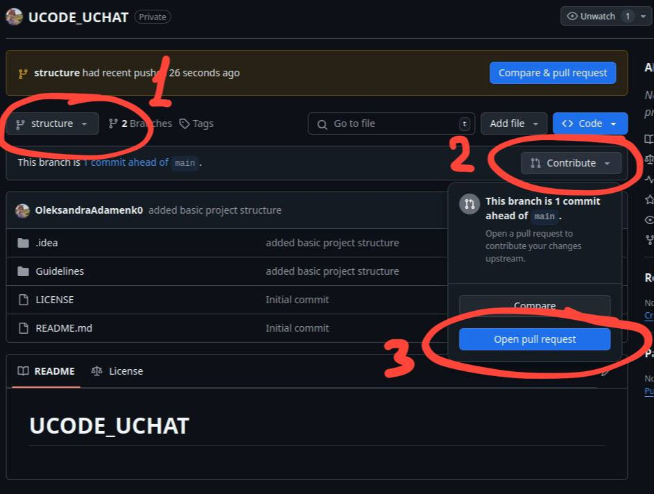
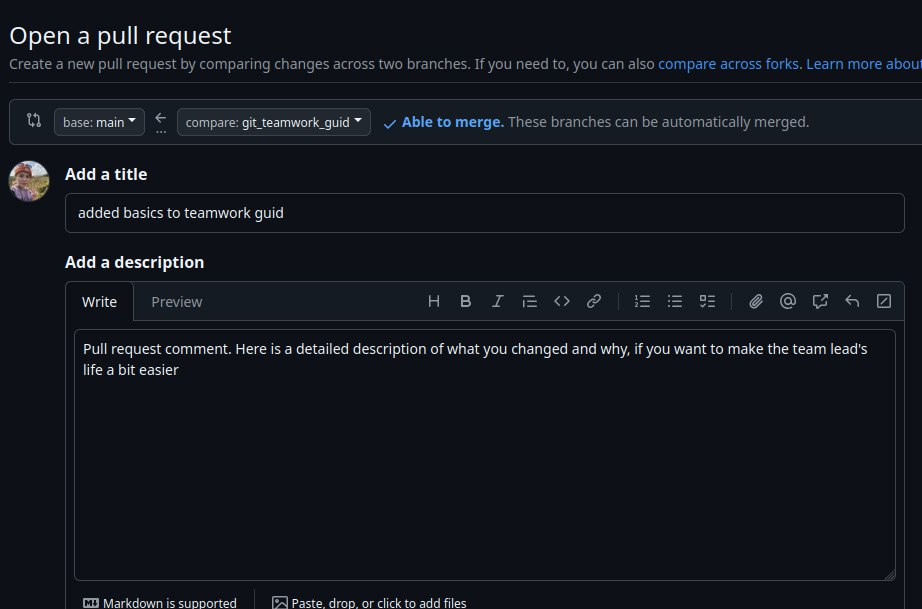

# Гайд з роботи з Git та GitHub в команді

Основні принципи роботи з Git та GitHub для вирішення типових проблем
та конфліктів при спільній роботі над проектом.

## Основні принципи 

### Синхронізація з віддаленим репозиторієм
Перед початком роботи завжди синхронізуйте локальний репозиторій з віддаленим,
використовуючи:

```bash
git pull origin main
```

Ця команда забезпечить, що ваш локальний код актуальний і не має конфліктів
з останніми змінами.

### Створення нових гілок

Для кожної нової функції або зміни створюйте нову гілку, 
щоб зберегти стабільність main гілки. Використовуйте:

```bash
git checkout -b branch-name
```
### Внесення змін та коміти

Внесіть зміни на новій гілці, додайте їх до стадії перед комітом і закомітьте:

```bash
git add .
git commit -m "Fixed memory leaks in function_name."
```

**Результат:**

```bash
[branch-name 1a2b3c4] Fixed memory leaks in function_name.
1 file changed, 10 insertions(+), 0 deletions(-)
```

### Пуш змін у віддалений репозиторій
Після внесення змін у вашій локальній гілці, потрібно надіслати ці зміни 
в попередньо створену гілку для поточної зміни у віддалений репозиторій.

```bash
git push origin branch-name
```
Успішне виконання:

```bash
user@maschine:~/path/UCODE_UCHAT$ git push origin feature-1
Enumerating objects: 5, done.
Counting objects: 100% (5/5), done.
Delta compression using up to 8 threads
Compressing objects: 100% (3/3), done.
Writing objects: 100% (3/3), 4.10 KiB | 1.02 MiB/s, done.
Total 3 (delta 2), reused 0 (delta 0)
To github.com:username/repo.git
a1b2c3d..e4f5g6h  feature-1 -> feature-1
```

### Перейдіть на GitHub і створіть пул реквест

Натисніть кнопку "Compare & pull request" на головній сторінці 

**!!! Зверніть увагу на назву гілки. Робіть pull request лише власних гілок**



Або зменіть гілку з main на власну і натисніть кнопку "pull request" 
в повідомленні у власній гілці



Відкриття пул реквесту


